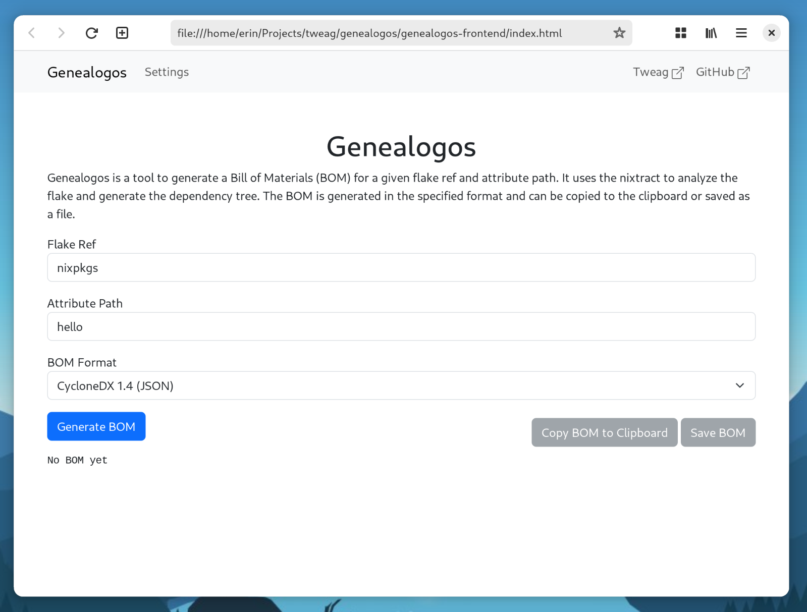

[![Contributors][contributors-shield]][contributors-url]
[![Forks][forks-shield]][forks-url]
[![Stargazers][stars-shield]][stars-url]
[![Issues][issues-shield]][issues-url]
[![MIT License][license-shield]][license-url]
[![Discord][discord-shield]][discord-url]

# Genealogos
<p align="center">
   
</p>

## About The Project
<p align="center">
   
</p>

The Genealogos project is a tool that takes output from Nix evaluation tools and produces BOM files.
Currently, it takes input from [nixtract][nixtract-url] and produces json output compliant with the [CycloneDX][cyclonedx-url] 1.3 or 1.4 specification.<!-- TODO: 1.5 -->
Output from Genealogos can be used by various other tools to perform further analysis.

Note Nix is mainly just suitable for Software, and so the BOM output by Genealogos is nearly always an SBOM.
However, for consistency, we will refer to the output as a BOM.

Genealogos may already be used to generate SBOMs but it is important to realize there exist some known issues.
See the section at the end of this readme for a list of known issues and other limitations.

## Installing Genealogos-cli
Right now, Genealogos is only distributed via our Nix Flake.
Ensure you have the experimental features `flakes` and `nix-command` enabled, and then run:
```fish
# To run once
nix run github:tweag/genealogos -- --help

# To temporarily add to $PATH
nix shell github:tweag/genealogos
```

You can also forgo Nix and use cargo directly instead.
However, in this case you are sponsible for ensuring the dependencies are available.
```fish
cargo install --git https://github.com/tweag/genealogos.git genealogos-cli
```

## Installing Genealogos-api (and frontend)
The installation methods for the cli can easily be adjusted for the api.
```fish
# To run once
nix run github:tweag/genealogos#genealogos-api

# To temporarily add to $PATH
nix shell github:tweag/genealogos#genealogos-api

# Cargo install
cargo install --git https://github.com/tweag/genealogos.git genealogos-api
```

The `frontend` feature is enabled by default, so once the api is running open `http://localhost:8000/` for the frontend.

## Hacking
### Prerequisites
Development of Genealogos requires Cargo, and some other dependencies.
We additionally recommend the use of `rust-analyzer` and `nixtract`.
The easiest way to get these tools it through the Nix development environment.
```fish
nix develop
````

Alternatively you can install the dependencies manually, but in that case you are on your own.

### Building
Building can be done using Cargo, either by specifying a specific package `cargo COMMAND -p [genealogos, genealogos-cli, genealogos-api]` or by running `cargo COMMAND` for the entire workspace.

## Usage
### `genealogos-cli`
Analyzing a local flake:
```fish
genealogos /path/to/your/local/flake
```

Analyzing `hello` from nixpkgs:
```fish
genealogos nixpkgs#hello
```

Using a trace file:
This section assumes you are using the latest `main` version version of [nixtract][nixtract].

```fish
nixtract --target-attribute-path hello /tmp/out && genealogos -f /tmp/out
```

For more `nixtract` arguments, see `nixtract --help`.

Setting backend options:
Any type that implements the `Backend` must have a way to include nar info and only include runtime options.
Genealogos will forward `--include-narinfo` and `--runtime-only` to the backend.
```fish
genealogos --include-narinfo --runtime-only nixpkgs#hello
```

#### Narinfo
When the backend is instructed to provide the narinfo via `--include-narinfo`, it is free to choose how to provide it.
Nixtract, for instance, queries the system and flake configured substituters, and returns provides their narinfo when found.
Genealogos collects the narinfo, and (for CycloneDX) adds it to the `components.properties` list with the `nix:narinfo:<FIELD_NAME>` name.

For a full set of options, see:
```fish
genealogos --help
```

### `genealogos-api`
Genealogos can also run as an API server using the `genealogos-api` binary.
`genealogos-api` provides two categories of endpoints.
A blocking endpoint and one based on jobs.

#### Blocking
Currently, there is only a single blocking endpoint: `/api/analyze?installable=<installable>`.
By default, `genealogos-api` binds itself on `localhost:8000`.

For example, using curl, the api can be invoked like this:
```fish
curl "http://localhost:8000/api/analyze?installable=nixpkgs%23hello"
```
Note that the `#` in `nixpkgs#hello` is URL Encoded.

Additionally an optional `bom_format` query parameter can be provided to specify the bom format to use.
Example:
```fish
curl "http://localhost:8000/api/analyze?installable=nixpkgs%23hello&cyclonedx_version=v1_4"
```

<!-- TODO: Add 1.5 support -->
Currently supported are `[cyclonedx_1.3_json, cyclonedx_1.3_xml, cyclonedx_1.4_json, cyclonedx_1.4_xml]`, with `cyclonedx_1.4_json` being the default.

#### Jobs
The jobs based API consists of three endpoints: `/api/jobs/create`, `/api/jobs/status`, and `/api/jobs/result`.

Creating a job is done in a similar fashion to the blocking api:
```fish
curl "http://localhost:8000/api/jobs/create?installable=nixpkgs%23hello"
```
This endpoint also supports the `bom_format` query parameter.
The response of this API call is a `job_id`, which needs to be passed to further calls to indentify the desired job.

Getting the status of a job is done as such:
```fish
curl "http://localhost:8000/api/jobs/status/0"
```
where 0 was the `job_id` provided in the previous call.
This API can return one of `stopped`, `running` and `done`.

Finally, getting the result is done with the `result` endpoint:
```fish
curl "http://localhost:8000/api/jobs/result/0"
```

#### Configuration
The `genealogos-api` can be configured through [Rocket](https://rocket.rs)'s configuration mechanism.
It uses the [default providers](https://rocket.rs/guide/v0.5/configuration/#default-provider) defined by Rocket.
The [default options](https://rocket.rs/guide/v0.5/configuration/#overview) contain all things related to the webserver itself.
In addition to those default configuration options, Genealogos extends Rockets' configuration with two additional keys:

| key              | kind               | description                                                        | debug/release default |
|------------------|--------------------|--------------------------------------------------------------------|-----------------------|
| `gc_interval`    | `u64` (in seconds) | The interval between two invocations of the garbage collector      | `10`                  |
| `gc_stale_after` | `u64` (in seconds) | How long after being touched last a job should be considered stale | `60 * 10`             |

### `genealogos-frontend`
Genealogos ships with a pure html/javascript web frontend.
By default, this frontend uses `127.0.0.1` to connect to the `genealogos-api`.
Changing this default can be done using the settings button in the top of the webpage.

The Web UI currently only supports analyzing from a flake ref and attribute path, analyzing from a trace file is not yet supported.

The frontend can be opened by opening the `index.html`file in your favourite web browser.
Alternatively, if the `genealogos-api` was built with the `frontend` feature-flag, the frontend can be accessed at the root of wherever the api is hosted (e.g. `http://localhost:8000/`).

### NixOS Module
The flake in this project provides a NixOS Module to host Genealogos.
Once the module has been added to your NixOS configuration, Genealogos can be enabled with:

```nix
services.genealogos.enable = true;
```

For further options see `./nix/genealogos-module.nix`.

## Contributing
Contributions are what make the open source community such an amazing place to learn, inspire, and create. Any contributions you make are **greatly appreciated**.

If you have a suggestion that would make this better, please fork the repo and create a pull request. You can also simply open an issue.

## Testing
Genealogos is tested against fixtures in `genealogos/tests/fixtures/nixtract/success/`.
With each `.in` file containing `nixtract` output and each `.out` file containing the corresponding expected `genealogos` output.
Testing against these fixtures is done automatically by `nix build`, but can also manually be performed using `cargo test`.
Typically, `genealogos` output is non-deterministic (the UUID is random, and the order of elements in lists is random), which makes testing a little more annoying.
To overcome this hurdle, when running `cargo test`, or when setting the `GENEALOGOS_DETERMINISTIC` environment variable, the output of `genealogos` is made deterministc.
This is done by setting the UUID to all zeroes, and sorting the `dependsOn` lists.

In order to make working with these fixtures a little nicer, the `nix develop .#scripts` devShell provides two scripts.
`verify-fixture-files`, which verifies the `.out` files with the `cyclonedx-cli` tool to ensure `genealogos` produces valid CycloneDX.
And `update-fixture-files`, which should be ran when an update to `genealogos` changes its output.
Note that this second script requires that `genealogos-cli` is buildable.

## Known issues and limitations
Currently, Genealogos (through nixtract) tries to find all attributes that are input derivation to whatever package is being analyzed.
This means some inputs can be missed, in particular those that are part of string contexts.

Additionally, Nixtract (through Genealogos) restarts nix for every SBOM component.
When evaluation of your derivation takes a long time, this will result in very slow SBOM generation.

## License
Distributed under the MIT License. See `LICENSE` for more information.

## Contact
[![Tweag][tweag-logo]][tweag-url]

GitHub: [https://github.com/tweag/genealogos](https://github.com/tweag/genealogos)

[contributors-shield]: https://img.shields.io/github/contributors/tweag/genealogos.svg?style=for-the-badge
[contributors-url]: https://github.com/tweag/genealogos/graphs/contributors
[forks-shield]: https://img.shields.io/github/forks/tweag/genealogos.svg?style=for-the-badge
[forks-url]: https://github.com/tweag/genealogos/network/members
[stars-shield]: https://img.shields.io/github/stars/tweag/genealogos.svg?style=for-the-badge
[stars-url]: https://github.com/tweag/genealogos/stargazers
[issues-shield]: https://img.shields.io/github/issues/tweag/genealogos.svg?style=for-the-badge
[issues-url]: https://github.com/tweag/genealogos/issues
[license-shield]: https://img.shields.io/github/license/tweag/genealogos.svg?style=for-the-badge
[license-url]: https://github.com/tweag/genealogos/blob/master/LICENSE.txt
[discord-shield]: https://img.shields.io/badge/-Discord-black.svg?style=for-the-badge&logo=discord&colorB=555
[discord-url]: https://discord.gg/fFymRGGRDG
[tweag-logo]: ./assets/tweag.png
[tweag-url]: https://tweag.io
[nixtract-url]: https://github.com/tweag/nixtract
[cyclonedx-url]: https://cyclonedx.org/

[screenshot]: ./assets/screenshot.png
[genealogos-logo]: ./assets/genealogos.png
